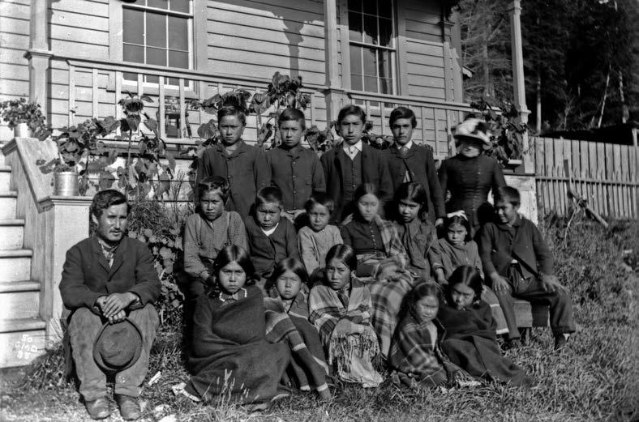

Canada denied the right to participate fully in Canadian political, economic, and social life to those Aboriginal people who refused to abandon their Aboriginal identity. [6]

Canada outlawed Aboriginal spiritual practices, jailed Aboriginal spiritual leaders, and confiscated sacred objects. [7]

And, Canada separated children from their parents, sending them to residential schools. This was done not to educate them, but primarily to break their link to their culture and identity. In justifying the government's residential school policy, Canada's first prime minister, Sir John A. Macdonald, told the House of Commons in 1883:

> When the school is on the reserve the child lives with its parents, who are savages; he is surrounded by savages, and though he may learn to read and write his habits, and training and mode of thought are Indian. He is simply a savage who can read and write. It has been strongly pressed on myself, as the head of the Department, that Indian children should be withdrawn as much as possible from the parental influence, and the only way to do that would be to put them in central training industrial schools where they will acquire the habits and modes of thought of white men. [8]

These measures were part of a coherent policy to eliminate Aboriginal people as distinct peoples and to assimilate them into the Canadian mainstream against their will. Deputy Minister of Indian Affairs Duncan Campbell Scott outlined the goals of that policy in 1920, when he told a parliamentary committee that "our object is to continue until there
