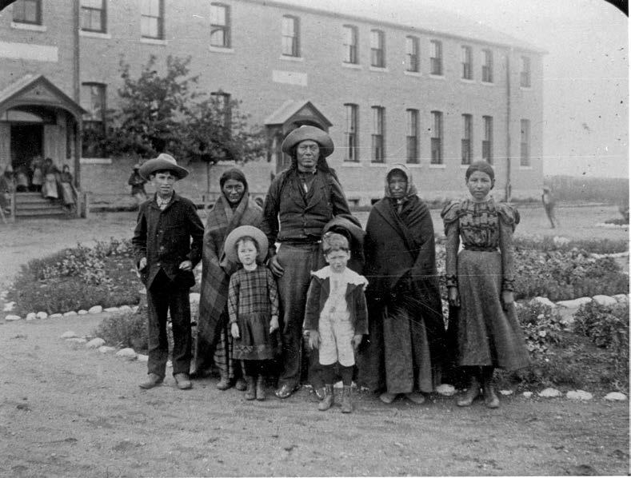

beliefs." [[intro:15]] United Church official George Dorey told the same committee that he questioned whether there was such a thing as "native religion." [[intro:16]]

Into the 1950s and 1960s, the prime mission of residential schools was the cultural transformation of Aboriginal children. In 1953, J. E. Andrews, the principal of the Presbyterian school in Kenora, Ontario, wrote that "we must face realistically the fact that the only hope for the Canadian Indian is eventual assimilation into the white race." [[intro:17]] In 1957, the principal of the Gordon's Reserve school in Saskatchewan, Albert Southard, wrote that he believed that the goal of residential schooling was to "change the philosophy of the Indian child. In other words since they must work and live with `whites' then they must begin to think as `whites.'" Southard said that the Gordon's school could never have a student council, since "in so far as the Indian understands the department's policy, he is against it." [[intro: 18]] In a 1958 article on residential schools, senior Oblate Andre Renaud echoed the words of John A. Macdonald, arguing that when students at day schools went back to their "homes at the end of the school day and for the weekend, the pupils are re-exposed to their native culture, however diluted, from which the school is trying to separate them." A residential school, on the other hand, could "surround its pupils almost twenty-four hours a day with
