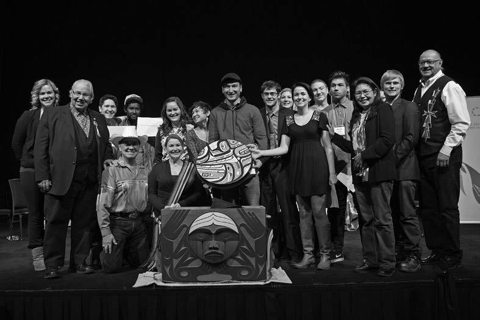

> We have re-examined our thoughts and beliefs around colonialism, and have made a commitment to unpack our own baggage, and to enter into a new relationship with each other, using this momentum, to move our country forward, in light of the 150th anniversary of the Confederation of Canada in 2017.
> At this point in time, we ask ourselves, "What does that anniversary mean for us, as Indigenous youth and non-Indigenous youth, and how do we arrive at that day with something we can celebrate together?"... Our hope is that, one day, we will live together, as recognized nations, within a country we can all be proud of. [[intro:28]]

In 2013, at the British Columbia National Event in Vancouver, where over 5,000 elementary and secondary school students attended Education Day, several non-Aboriginal youth talked about what they had learned. Matthew Meneses said, "I'll never forget this day. This is the first day they ever told us about residential schools. If I were to see someone who's Aboriginal, I'd ask them if they can speak their language because I think speaking their language is a pretty cool thing." Antonio Jordao said, "It makes me sad for those kids. They took them away from their homes--it was torture, it's not fair. They took them away from their homes. I don't agree with that. It's really wrong. That's one of the worst things that Canada did." Cassidy Morris said, "It's good that we're finally learning about what happened." Jacqulyn Byers told us, "I hope that events like this are able to bring closure to
