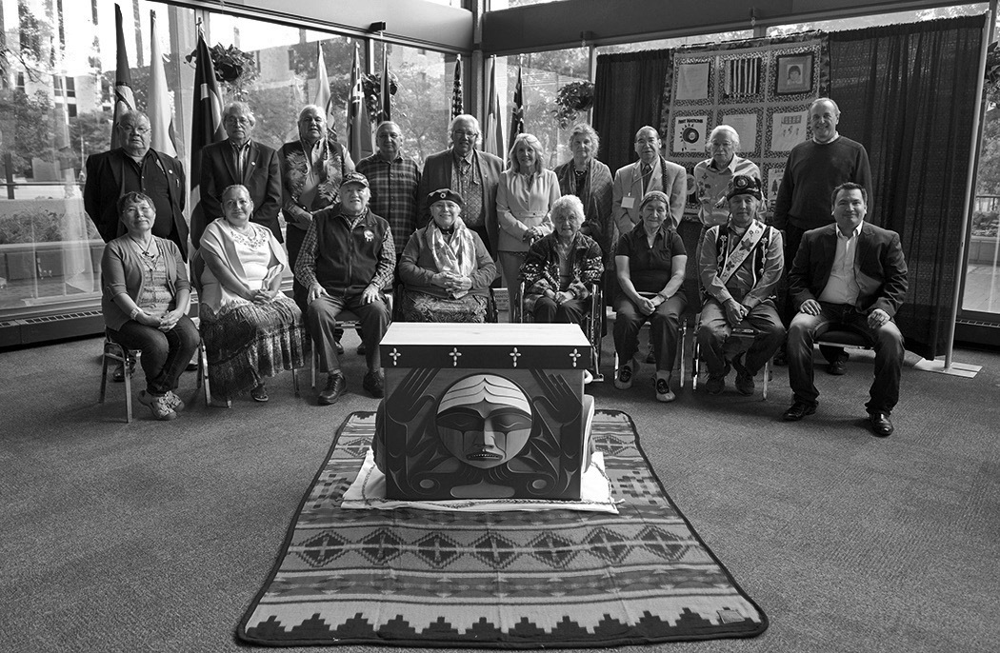

the horrible things that happened, and that a whole lot of people now recognize that the crime happened and that we need to make amends for it." [[image:29]]

At the same National Event, trc Honorary Witness Patsy George paid tribute to the strength of Aboriginal women and their contributions to the reconciliation process despite the oppression and violence they have experienced. She said,

> Women have always been a beacon of hope for me. Mothers and grandmothers in the lives of our children, and in the survival of our communities, must be recognized and supported. The justified rage we all feel and share today must be turned into instruments of transformation of our hearts and our souls, clearing the ground for respect, love, honesty, humility, wisdom and truth. We owe it to all those who suffered, and we owe it to the children of today and tomorrow. May this day and the days ahead bring us peace and justice. [[intro:30]]

Aboriginal and non-Aboriginal Canadians from all walks of life spoke to us about the importance of reaching out to one another in ways that create hope for a better future. Whether one is First Nations, Inuit, Métis, a descendant of European settlers, a member of a minority group that suffered historical discrimination in Canada, or a new Canadian, we all inherit both the benefits and obligations of Canada. We are all Treaty people who share responsibility for taking action on reconciliation.
