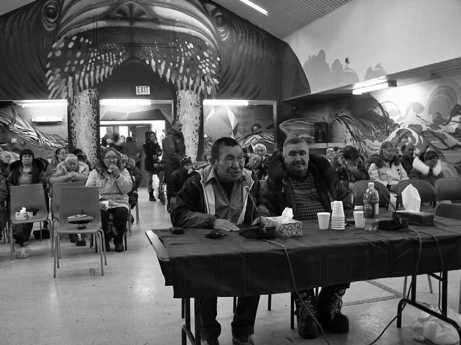

Territories, recognizing the high rates of incarceration of Aboriginal peoples and how the experience of residential schools has contributed to the kinds of personal struggles that may lead to incarceration. Health-support workers, cultural support workers, and/or professional therapists were present everywhere the Commission gathered statements to provide support and counselling as needed.

In an effort to understand all aspects of the residential school experience, the Commission also made a concerted effort to gather statements from former staff of residential schools. With the assistance of the church parties to the Settlement Agreement, the Commission conducted ninety-six separate interviews with former staff and the children of former staff. In addition, the Commission received statements from former staff and their family members at its National and Regional Events and Community Hearings. The statements gathered will form part of a permanent collection of documents relating to residential schools.

Under the terms of the Settlement Agreement, the federal government and the churches were obliged to turn over relevant documents in their possession to the Commission. The Commission has had to overcome some significant challenges to completing this task, and has had to seek court direction to resolve disputes with the parties about the handing
